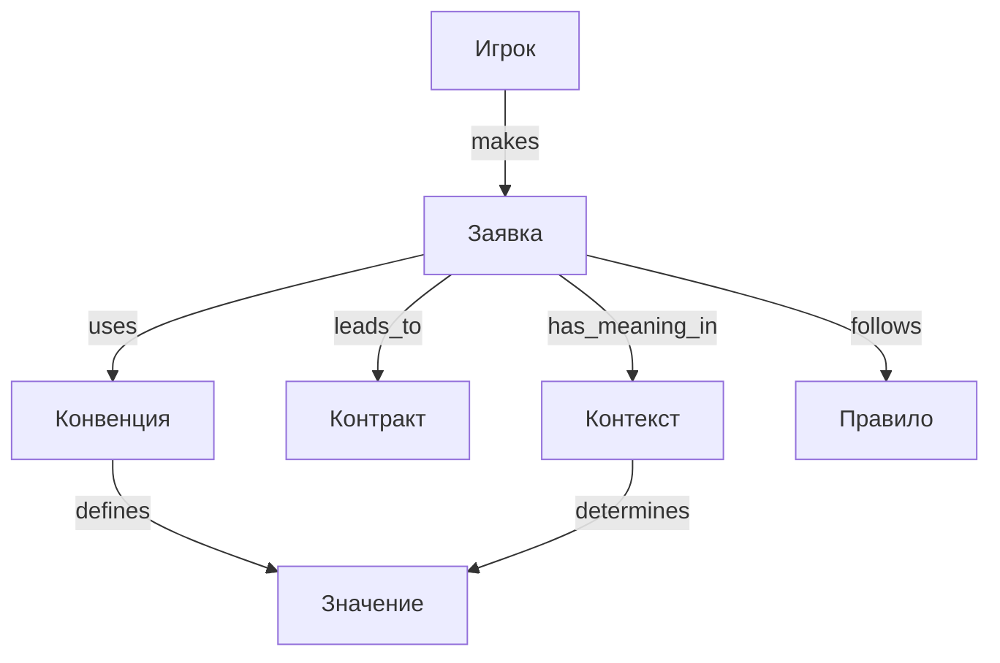
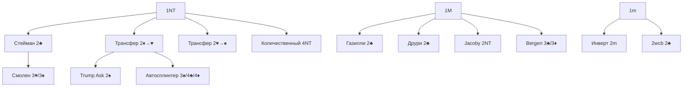

> [!abstract]+ Об онтологии
> Формализованное представление знаний о языке торговли в бридже. Описывает структуру, классы, отношения и правила системы "Система 5542".

---

# Онтология языка торговли в Bridge

## 1. Введение

**Онтология** - это формализованное представление знаний в определенной предметной области, включающее:

- **Концепты (классы)** - базовые сущности
- **Отношения** - связи между концептами
- **Атрибуты** - свойства концептов
- **Правила** - ограничения и аксиомы
- **Экземпляры** - конкретные реализации

**Цель данной онтологии:** Формализовать язык торговли в бридже для:

- Обучения (систематизация знаний)
- Анализа (понимание структуры)
- Автоматизации (разработка ИИ для бриджа)
- Стандартизации (единый язык описания)

---

# 2. Верхний уровень онтологии

## 2.1. Базовые концепты

```
Торговля (Auction)
├── Заявка (Call)
│   ├── Бид (Bid)
│   ├── Пас (Pass)
│   ├── Контра (Double)
│   └── Реконтра (Redouble)
├── Контракт (Contract)
├── Контекст (Context)
└── Правила (Rules)
```

---

# 3. Класс: Заявка (Call)

## 3.1. Определение

**Заявка** - элементарная единица торговли, произносимая игроком в свою очередь.

## 3.2. Подклассы

### 3.2.1. Бид (Bid)

**Определение:** Заявка уровня + масти

**Атрибуты:**

- `level`: Integer [1..7] - уровень (количество взяток сверх 6)
- `strain`: Enum {♣, ♦, ♥, ♠, NT} - масть/БК
- `hcp_min`: Integer [0..37] - минимальная сила (high card points)
- `hcp_max`: Integer [0..37] - максимальная сила
- `shape`: String - распределение (например, "5332", "4441")
- `forcing`: Boolean - форсирующая ли заявка
- `conventional`: Boolean - искусственная (конвенция) или натуральная

**Иерархия бидов:**

```
Бид
├── Натуральный бид (Natural Bid)
│   ├── Открытие (Opening)
│   ├── Ответ (Response)
│   └── Ребид (Rebid)
└── Искусственный бид (Conventional Bid)
    ├── Релей (Relay)
    ├── Вопрос (Ask)
    └── Трансфер (Transfer)
```

### 3.2.2. Пас (Pass)

**Определение:** Отказ от заявки

**Атрибуты:**

- `forcing`: Boolean - форсирующий ли пас (зависит от контекста)
- `reason`: Enum {weak, waiting, forcing, tactical}

**Виды паса:**

```
Пас
├── Обычный пас (слабая рука)
├── Форсирующий пас (Forcing Pass)
└── Тактический пас (ловушка)
```

### 3.2.3. Контра (Double)

**Определение:** Специальная заявка "Контра"

**Атрибуты:**

- `type`: Enum {takeout, negative, penalty, support, responsive, maximal, lightner, lead_directing}
- `hcp_min`: Integer
- `message`: String - что показывает

**Виды контры:**

```
Контра
├── Вызывная (Takeout)
├── Негативная (Negative)
├── Наказательная (Penalty)
├── Информационная
│   ├── Support Double
│   ├── Responsive Double
│   └── Maximal Double
└── Специальная
    ├── Lightner Double
    └── Lead-Directing Double
```

### 3.2.4. Реконтра (Redouble)

**Определение:** Ответ на контру

**Атрибуты:**

- `type`: Enum {strong, support, sos}
- `hcp_min`: Integer
- `message`: String

**Виды реконтры:**

```
Реконтра
├── Силовая (Strong) - 10+hcp
├── Поддержки (Support) - ровно 3 карты
└── SOS - просьба о помощи
```

---

# 4. Класс: Контракт (Contract)

## 4.1. Определение

**Контракт** - финальный результат торговли.

## 4.2. Атрибуты

- `level`: Integer [1..7]
- `strain`: Enum {♣, ♦, ♥, ♠, NT}
- `declarer`: Enum {North, South, East, West}
- `doubled`: Boolean
- `redoubled`: Boolean
- `contract_string`: String (например, "4♠X")

## 4.3. Типы контрактов

```
Контракт
├── Частичная (Partscore) - уровень 1-3
├── Гейм (Game) - уровень 4-5
│   ├── 3NT (9 взяток)
│   ├── 4♥/4♠ (10 взяток)
│   └── 5♣/5♦ (11 взяток)
└── Шлем (Slam)
    ├── Малый шлем (Small Slam) - 6 уровень
    └── Большой шлем (Grand Slam) - 7 уровень
```

---

# 5. Класс: Контекст (Context)

## 5.1. Определение

**Контекст** - совокупность условий, определяющих значение заявки.

## 5.2. Атрибуты

- `position`: Enum {1st, 2nd, 3rd, 4th} - позиция игрока
- `vulnerability`: Enum {none, favorable, unfavorable, both} - зональность
- `auction_history`: List[Call] - история торговли
- `partnership_state`: Enum {unopposed, competitive} - односторонняя/конкурентная
- `forcing_level`: Enum {not_forcing, forcing_one_round, game_forcing}

## 5.3. Контекстные зоны

```
Контекст торговли
├── Фаза торговли
│   ├── Открытие (Opening)
│   ├── Ответ (Response)
│   ├── Ребид (Rebid)
│   └── Финализация (Game/Slam decision)
├── Тип торговли
│   ├── Односторонняя (Unopposed)
│   └── Конкурентная (Competitive)
└── Уровень форсинга
    ├── Не форсирующая (Non-forcing)
    ├── Форсирует на 1 круг (Forcing for 1 round)
    └── Форсирует до гейма (Game forcing)
```

---

# 6. Класс: Конвенция (Convention)

## 6.1. Определение

**Конвенция** - согласованная интерпретация заявки, отличная от натурального значения.

## 6.2. Атрибуты

- `name`: String - название конвенции
- `trigger`: Call - заявка, запускающая конвенцию
- `responses`: Map[Call -> Meaning] - возможные ответы
- `preconditions`: List[Condition] - условия применения
- `hcp_range`: Tuple[Integer, Integer]
- `shape_requirements`: String

## 6.3. Таксономия конвенций

```
Конвенция
├── По фазе
│   ├── Открывающие (Opening conventions)
│   ├── Ответные (Response conventions)
│   └── Развивающие (Development conventions)
├── По типу
│   ├── Вопрос (Asking)
│   ├── Показ (Showing)
│   ├── Трансфер (Transfer)
│   └── Релей (Relay)
└── По назначению
    ├── Поиск фита (Fit-finding)
    ├── Различение силы (Strength-showing)
    ├── Показ распределения (Shape-showing)
    └── Контроль (Control-asking)
```

### 6.3.1. Примеры конвенций (экземпляры класса)

**Стейман:**

```yaml
name: "Stayman"
trigger: Bid(level=2, strain=♣) after Bid(1, NT)
type: Asking
question: "Есть ли 4-карточный мажор?"
responses:
  2♦: "Нет 4М"
  2♥: "Есть 4♥ (может быть 4♠)"
  2♠: "Есть 4♠, нет 4♥"
preconditions:
  - previous_bid == 1NT
  - responder has 4M OR 44 majors
hcp_range: [8, 37]
conventional: true
```

**Трансфер:**

```yaml
name: "Transfer to Hearts"
trigger: Bid(level=2, strain=♦) after Bid(1, NT)
type: Transfer
meaning: "5+♥, любая сила"
responses:
  2♥: "Обычный прием (2-3♥)"
  3♣/3♦/3♠: "Суперприем (4♥, 16-17hcp, краткость)"
  3♥: "Суперприем (4♥, 15hcp)"
hcp_range: [0, 37]
shape_requirements: "5+H"
conventional: true
```

---

# 7. Класс: Значение (Meaning)

## 7.1. Определение

**Значение** - семантическая интерпретация заявки в контексте.

## 7.2. Атрибуты

- `hcp_range`: Tuple[Integer, Integer] - диапазон силы
- `suits`: Map[Suit -> Integer] - длины мастей
- `distribution`: String - общее распределение
- `forcing_status`: Enum {NF, F1, GF, INV}
- `message`: String - что сообщает партнеру

## 7.3. Типы значений

```
Значение заявки
├── Силовое (Strength)
│   ├── Слабая (0-7hcp)
│   ├── Средняя (8-11hcp)
│   ├── Хорошая (12-15hcp)
│   ├── Сильная (16-18hcp)
│   └── Очень сильная (19+hcp)
├── Распределение (Shape)
│   ├── Сбалансированная (balanced)
│   ├── Односоставная (one-suited)
│   ├── Двухсоставная (two-suited)
│   └── Трехсоставная (three-suited)
└── Отношение к масти партнера
    ├── Фит (Fit) - 3+ карты
    ├── Нет фита (No fit)
    └── Неизвестно (Unknown)
```

---

# 8. Отношения между концептами

## 8.1. Основные отношения



## 8.2. Отношения в деталях

### 8.2.1. hasContext

**Определение:** Заявка имеет значение только в контексте

```
Call --hasContext--> Context
```

**Пример:**

- `Пас` в контексте "(1♠)-Пас-Пас" = слабая рука
- `Пас` в контексте "1♠-3♠-4♠-(5♥)" = форсирующий пас

### 8.2.2. requires

**Определение:** Конвенция требует предварительных условий

```
Convention --requires--> Precondition
```

**Пример:**

- `Стейман (2♣)` requires `предыдущая заявка = 1NT`
- `Друри (2♣)` requires `позиция = 3-4 рука` AND `партнер открыл 1М`

### 8.2.3. supersedes

**Определение:** Одно правило отменяет другое в определенном контексте

```
Rule --supersedes--> Rule [in Context]
```

**Пример:**

- `Балансирующая контра (8+hcp)` supersedes `Обычная контра (12+hcp)` в контексте `1х-Пас-Пас`

### 8.2.4. impliesFit

**Определение:** Заявка подразумевает фит в масти

```
Call --impliesFit--> Suit [min_length]
```

**Пример:**

- `Support Double` impliesFit масть партнера [ровно 3 карты]
- `Bergen 3♣` impliesFit мажор партнера [4 карты]

### 8.2.5. asks

**Определение:** Конвенция задает вопрос

```
Convention --asks--> Question
```

**Примеры:**

- `Стейман` asks "Есть ли 4М?"
- `Блэквуд (4NT)` asks "Сколько тузов?"
- `RKCB` asks "Сколько ключевых карт?"

---

# 9. Правила и ограничения

## 9.1. Структурные правила

### 9.1.1. Правило последовательности

**Формализация:**

```
∀ bid₁, bid₂ : Bid
  bid₂ follows bid₁ → level(bid₂) ≥ level(bid₁) OR strain_order(bid₂) > strain_order(bid₁)
```

**На естественном языке:**
Каждая следующая заявка должна быть выше предыдущей по уровню или масти.

**Порядок мастей:**

```
♣ (0) < ♦ (1) < ♥ (2) < ♠ (3) < NT (4)
```

### 9.1.2. Правило окончания торговли

**Формализация:**

```
auction_ends ↔ (consecutive_passes = 3) OR (pass_after_all_pass_X_XX = 1)
```

**На естественном языке:**
Торговля заканчивается после:

- 3 последовательных пасов
- Или 1 паса после того, как все спасовали на Контру/Реконтру

### 9.1.3. Правило контры

**Формализация:**

```
∀ player : Player, call : Call
  player can_make Double →
    ∃ opponent_bid : Bid [opponent_bid is last_bid AND opponent made opponent_bid]
```

**На естественном языке:**
Контровать можно только заявку противника.

## 9.2. Семантические правила

### 9.2.1. Правило открытия

**Формализация:**

```
∀ opening : Opening
  opening.position = 1st_seat → opening.hcp ≥ 12 OR opening.rule_of_20 = true
```

**Правило 20:**

```
HCP + длина_1й_масти + длина_2й_масти ≥ 20
```

### 9.2.2. Правило форсинга

**Формализация:**

```
∀ bid : Bid
  bid.forcing = true → partner must_make_another_call
```

**На естественном языке:**
После форсирующей заявки партнер обязан сделать еще одну заявку (не может пасовать).

### 9.2.3. Правило конвенции

**Формализация:**

```
∀ conv : Convention, context : Context
  context.satisfies(conv.preconditions) →
    meaning(conv.trigger, context) = conv.conventional_meaning
  ELSE
    meaning(conv.trigger, context) = natural_meaning(conv.trigger)
```

**На естественном языке:**
Конвенция применяется только если выполнены все предварительные условия, иначе заявка имеет натуральное значение.

---

# 10. Зоны силы (Strength Zones)

## 10.1. Определение зон

```
Сила руки
├── Очень слабая: 0-5 hcp
├── Слабая: 6-9 hcp
├── Инвит: 10-11 hcp
├── Гейм минимум: 12-14 hcp
├── Гейм максимум: 15-17 hcp
└── Сильная: 18+ hcp
```

## 10.2. Правила сложения сил

**Для гейма:**

```
3NT: 25+ hcp
4♥/4♠: 25+ hcp (но может быть 23 с хорошим фитом)
5♣/5♦: 28+ hcp
```

**Для шлема:**

```
6 уровень: 33+ hcp
7 уровень: 37 hcp (почти все очки)
```

---

# 11. Дерево решений торговли

## 11.1. Алгоритм выбора заявки

```
FUNCTION choose_call(hand, auction_history, context):

  # 1. Проверка обязательных действий
  IF auction is forcing:
    IF have_good_suit:
      RETURN bid_suit()
    ELSE IF have_fit:
      RETURN support_partner()
    ELSE:
      RETURN bid_notrump() OR bid_relay()

  # 2. Проверка применимости конвенций
  conventions = get_applicable_conventions(auction_history, hand)
  IF conventions is not empty:
    best_conv = select_best_convention(conventions, hand)
    RETURN best_conv.trigger

  # 3. Натуральная торговля
  IF hand.hcp < opening_strength AND not_in_balancing_position:
    RETURN Pass

  IF is_opening_position:
    RETURN select_opening(hand)

  IF is_response_position:
    RETURN select_response(hand, partner_opening)

  # 4. Конкурентная торговля
  IF opponents_interfered:
    IF can_double:
      RETURN Double
    ELSE IF can_overcall:
      RETURN overcall()
    ELSE:
      RETURN Pass

  # 5. По умолчанию
  RETURN Pass
```

---

# 12. Формальная модель конвенции

## 12.1. Общая структура

```python
class Convention:
    name: str
    trigger_pattern: CallPattern
    preconditions: List[Condition]
    responses: Dict[Call, Meaning]
    asks: Optional[Question]
    shows: Optional[Information]

    def is_applicable(self, context: Context) -> bool:
        return all(cond.evaluate(context) for cond in self.preconditions)

    def get_meaning(self, call: Call, context: Context) -> Meaning:
        if call in self.responses:
            return self.responses[call]
        return natural_meaning(call)
```

## 12.2. Пример: Стейман

```python
stayman = Convention(
    name="Stayman",
    trigger_pattern=CallPattern(
        bid=Bid(level=2, strain=Clubs),
        after=Bid(level=1, strain=NoTrump)
    ),
    preconditions=[
        Condition("previous_bid == 1NT"),
        Condition("responder.has_major(4)")
    ],
    asks=Question("Do you have 4-card major?"),
    responses={
        Bid(2, Diamonds): Meaning(
            description="No 4-card major",
            majors=(0, 3, 0, 3),  # max 3 in each major
            hcp_range=(15, 17)
        ),
        Bid(2, Hearts): Meaning(
            description="4+ hearts (may have 4 spades)",
            hearts=4,
            hcp_range=(15, 17)
        ),
        Bid(2, Spades): Meaning(
            description="4 spades, no 4 hearts",
            spades=4,
            hearts=(0, 3),
            hcp_range=(15, 17)
        )
    }
)
```

---

# 13. Система типов заявок

## 13.1. Базовые типы

```typescript
// Тип заявки
type Call = Bid | Pass | Double | Redouble

// Бид
interface Bid {
  level: 1 | 2 | 3 | 4 | 5 | 6 | 7
  strain: Suit | "NT"
  meaning?: Meaning
}

// Масть
type Suit = "♣" | "♦" | "♥" | "♠"

// Значение
interface Meaning {
  hcp: Range
  distribution: Distribution
  forcing: ForcingLevel
  fit?: SuitFit
  message: string
}

// Диапазон очков
interface Range {
  min: number
  max: number
}

// Распределение
interface Distribution {
  clubs: number
  diamonds: number
  hearts: number
  spades: number
}

// Уровень форсинга
type ForcingLevel = "NF" | "F1" | "GF" | "INV"

// Фит в масти
interface SuitFit {
  suit: Suit
  length: number
}
```

---

# 14. Граф зависимостей конвенций

## 14.1. Связи между конвенциями



## 14.2. Конфликты и приоритеты

**Проблема:** Одна и та же заявка может иметь разные значения

**Пример:**

```
1М - 2♣
```

**Возможные значения:**

1. **Друри** (если открытие на 3-4 руке после пасов)
2. **GF заявка** (если открытие на 1-2 руке)
3. **Газилли** (после 1М-1♠)

**Правило разрешения:**

```
IF position IN [3rd, 4th] AND opener_passed:
  meaning = Drury
ELSE IF auction_is [1M, 1S, 2C]:
  meaning = Gazilli
ELSE:
  meaning = Natural_GF
```

---

# 15. Метаправила системы

## 15.1. Правила приоритета

**Порядок применения:**

1. **Структурные правила** (последовательность, уровень)
2. **Конвенции** (если предусловия выполнены)
3. **Контекстные модификаторы** (балансирование, форсирующий пас)
4. **Натуральное значение** (по умолчанию)

## 15.2. Правила противоречий

**При конфликте значений:**

```
priority_order = [
  "Explicit agreement" >
  "Context override" >
  "Convention" >
  "Natural meaning"
]
```

## 15.3. Правило новичка (Novice Rule)

**Формализация:**

```
IF doubt_about_meaning:
  RETURN natural_interpretation
```

**На естественном языке:**
При сомнении в значении - интерпретируй натурально.

---

# 16. Применение онтологии

## 16.1. Для обучения

**Преимущества:**

- ✅ Систематизация знаний
- ✅ Понимание взаимосвязей
- ✅ Иерархическое изучение (от простого к сложному)

**Пример учебного пути:**

```
1. Базовые концепты (Заявка, Контракт, Значение)
2. Структурные правила (последовательность, уровни)
3. Натуральная торговля
4. Простые конвенции (Стейман, Трансферы)
5. Контекстные модификаторы (балансирование)
6. Сложные конвенции (Газилли, RKCB)
7. Конкурентная торговля (контры, реконтры)
```

## 16.2. Для анализа

**Возможности:**

- ✅ Формальная проверка системы на полноту
- ✅ Обнаружение противоречий
- ✅ Оптимизация (убрать избыточные конвенции)
- ✅ Сравнение разных систем

**Пример анализа:**

```
Вопрос: "Есть ли в системе способ показать 4♠5♥ после 1NT?"

Поиск в онтологии:
1. После 1NT доступны: Стейман (2♣), Трансферы (2♦, 2♥)
2. Стейман → 2♦ (нет 4М) → Смолен 3♠ (показывает 4♠5♥!)
3. Ответ: ДА, через Стейман + Смолен
```

## 16.3. Для ИИ и автоматизации

**Применения:**

- ✅ Разработка бриджевого ИИ (бот для торговли)
- ✅ Анализатор торгов (проверка правильности)
- ✅ Помощник в обучении (подсказки)
- ✅ Генератор раздач (с учетом торговли)

**Пример алгоритма ИИ:**

```python
def ai_choose_bid(hand, auction, system_ontology):
    # 1. Получить текущий контекст
    context = build_context(auction, hand)

    # 2. Найти применимые конвенции
    applicable = system_ontology.get_conventions(context)

    # 3. Оценить каждую возможную заявку
    best_bid = None
    best_score = -∞

    for convention in applicable:
        for bid in convention.possible_responses:
            score = evaluate_bid(bid, hand, auction, system_ontology)
            if score > best_score:
                best_score = score
                best_bid = bid

    # 4. Вернуть лучшую заявку
    return best_bid
```

## 16.4. Для стандартизации

**Цель:** Создание единого языка описания систем торговли

**Формат экспорта:**

```yaml
system:
  name: "Система 5542"
  version: "1.0"
  conventions:
    - name: "Stayman"
      trigger: "1NT-2♣"
      type: "asking"
      responses:
        - "2♦: No 4M"
        - "2♥: 4+H"
        - "2♠: 4S no 4H"
    - name: "Transfer to Hearts"
      trigger: "1NT-2♦"
      type: "transfer"
      meaning: "5+H"
      responses:
        - "2♥: Accept"
        - "3♣/3♦/3♠: Super-accept with shortness"
```

---

# 17. Расширения онтологии

## 17.1. Многосистемная онтология

**Идея:** Описать несколько систем в одной онтологии

```
Бриджевые системы
├── Натуральные системы
│   ├── Standard American (SAYC)
│   ├── 5-карточные мажоры (5542)
│   └── Acol (4-карточные мажоры)
├── Искусственные системы
│   ├── Precision (Strong 1♣)
│   ├── Swedish Club
│   └── Blue Club
└── Гибридные системы
```

## 17.2. Онтология защиты

**Расширение для карточной игры:**

```
Защита (Defense)
├── Выход (Opening Lead)
│   ├── Против БК
│   └── Против козырного контракта
├── Сигналы (Signals)
│   ├── Отношение (Attitude)
│   ├── Количество (Count)
│   └── Преференс (Suit Preference)
└── План защиты (Defense Plan)
```

## 17.3. Онтология розыгрыша

**Расширение для разыгрывающего:**

```
Розыгрыш (Declarer Play)
├── Анализ руки (Hand Analysis)
├── Линии игры (Lines of Play)
├── Техники (Techniques)
│   ├── Финес (Finesse)
│   ├── Импас (Squeeze)
│   └── Перебитие (Ruff)
└── Подсчет (Counting)
```

---

# 18. Формальная семантика

## 18.1. Денотационная семантика заявки

**Определение:**

```
Call: Context → Meaning

где:
- Call - синтаксическая заявка
- Context - контекст торговли
- Meaning - семантическое значение
```

**Примеры:**

```
1♠(empty_context) = {
  hcp: [12, 21],
  spades: [5, 13],
  forcing: false
}

Pass(context: [1♠, 3♠, 4♠, (5♥)]) = {
  forcing: true,
  message: "Решай: контра или 5♠?"
}

2♣(context: [1NT]) = {
  conventional: true,
  asks: "4M?",
  hcp: [8, 37]
}
```

## 18.2. Операционная семантика

**Правила перехода состояний:**

```
(Auction, Call) → Auction'

где:
- Auction - текущее состояние торговли
- Call - новая заявка
- Auction' - новое состояние
```

**Пример:**

```
([1NT], 2♣) → [1NT, 2♣]  -- Стейман запущен
([1NT, 2♣], 2♦) → [1NT, 2♣, 2♦]  -- Нет 4М
([1NT, 2♣, 2♦], 3NT) → [1NT, 2♣, 2♦, 3NT]  -- Финальный контракт
([1NT, 2♣, 2♦, 3NT], Pass) → Contract(3NT, South)  -- Торговля завершена
```

---

# 19. Примеры использования онтологии

## 19.1. Запросы к онтологии

**Запрос 1:** "Какие конвенции применимы после 1NT?"

```sparql
SELECT ?convention ?trigger
WHERE {
  ?convention rdf:type :Convention .
  ?convention :trigger_after :OneNoTrump .
  ?convention :trigger ?trigger .
}

RESULT:
- Stayman (2♣)
- Transfer to Hearts (2♦)
- Transfer to Spades (2♥)
- Transfer to Clubs (2♠)
- Transfer to Diamonds (2NT)
- 5431 (3♥/3♠)
- Exactly Game Forcing (4♣)
- Texas Transfer (4♦/4♥)
- Quantitative (4NT)
```

**Запрос 2:** "Какие заявки форсируют до гейма?"

```sparql
SELECT ?call ?trigger_sequence
WHERE {
  ?call rdf:type :Call .
  ?call :forcing_level :GameForcing .
  ?call :trigger_sequence ?trigger_sequence .
}

RESULT:
- 2♣ (Strong opening)
- Jump Shift (1♣-2♥)
- Jacoby 2NT (1M-2NT)
- Fourth Suit Forcing (некоторые случаи)
```

## 19.2. Проверка корректности торговли

**Пример валидатора:**

```python
def validate_auction(auction: List[Call], system: System) -> ValidationResult:
    context = Context()

    for i, call in enumerate(auction):
        # Проверка структурных правил
        if not is_valid_successor(call, context):
            return ValidationResult(
                valid=False,
                error=f"Call {call} at position {i} violates sequence rule"
            )

        # Проверка семантических правил
        meaning = system.get_meaning(call, context)
        if meaning.is_impossible():
            return ValidationResult(
                valid=False,
                error=f"Call {call} is semantically impossible in context {context}"
            )

        # Обновление контекста
        context = context.add_call(call)

    return ValidationResult(valid=True)
```

---

# 20. Заключение

## 20.1. Преимущества онтологического подхода

✅ **Систематизация** - структурированное представление знаний  
✅ **Формализация** - точные определения и правила  
✅ **Расширяемость** - легко добавлять новые конвенции  
✅ **Анализируемость** - можно проверять полноту и противоречия  
✅ **Автоматизация** - основа для ИИ и программных инструментов  
✅ **Обучение** - четкая структура для изучения  
✅ **Стандартизация** - единый язык описания систем

## 20.2. Дальнейшее развитие

**Возможные направления:**

1. **Расширение покрытия**
   - Добавить онтологию защиты
   - Добавить онтологию розыгрыша
   - Описать другие системы торговли

2. **Формальная верификация**
   - Проверка системы на полноту
   - Обнаружение противоречий
   - Оптимизация системы

3. **Практические инструменты**
   - Разработка ИИ на основе онтологии
   - Создание обучающей системы
   - Анализатор торгов

4. **Интеграция**
   - Экспорт в стандартные форматы (OWL, RDF)
   - Связь с другими онтологиями (общие знания)
   - Создание бриджевого knowledge graph

## 20.3. Ссылки на другие разделы системы

- [[0. О системе]] - Описание системы 5542
- [[Конвенции]] - Справочник всех конвенций
- [[Вист]] - Конкурентная торговля
- [[Шлемовая торговля]] - Методы исследования шлема

---

**Онтология - это живой документ, который развивается вместе с системой!**

[[0. О системе|← Назад к системе]]
